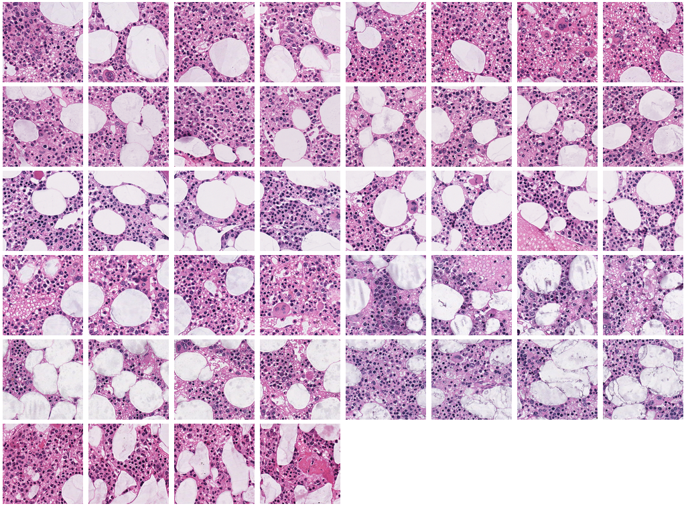

## Count-Ception: Counting by Fully Convolutional Redundant Counting ([arXiv](http://arxiv.org/abs/1703.08710))
### Joseph Paul Cohen, Genevieve Boucher, Craig A. Glastonbury, Henry Z. Lo, Yoshua Bengio

Counting objects in digital images is a process that should be replaced by machines. This tedious task is time consuming and prone to errors due to fatigue of human annotators. The goal is to have a system that takes as input an image and returns a count of the objects inside and justification for the prediction in the form of object localization. We repose a problem, originally posed by Lempitsky and Zisserman, to instead predict a count map which contains redundant counts based on the receptive field of a smaller regression network. The regression network predicts a count of the objects that exist inside this frame. By processing the image in a fully convolutional way each pixel is going to be accounted for some number of times, the number of windows which include it, which is the size of each window, (i.e., 32x32 = 1024). To recover the true count we take the average over the redundant predictions. Our contribution is redundant counting instead of predicting a density map in order to average over errors. We also propose a novel deep neural network architecture adapted from the Inception family of networks called the Count-ception network. Together our approach results in a 20% relative improvement (2.9 to 2.3 MAE) over the state of the art method by Xie, Noble, and Zisserman in 2016.


Citation request:

Count-ception: Counting by Fully Convolutional Redundant Counting<br>
JP Cohen, G Boucher, CA Glastonbury, HZ Lo, Y Bengio<br>
International Conference on Computer Vision (ICCV) Workshop on Bioimage Computing

```
@inproceedings{Cohen2017,
title = {Count-ception: Counting by Fully Convolutional Redundant Counting},
author = {Cohen, Joseph Paul and Boucher, Genevieve and Glastonbury, Craig A. and Lo, Henry Z. and Bengio, Yoshua},
booktitle = {International Conference on Computer Vision Workshop on BioImage Computing},
url = {http://arxiv.org/abs/1703.08710},
year = {2017}
}
```


Here is a video of the learning in progress:

[](https://www.youtube.com/watch?v=ej5bj0mlQq8)

And another video of learning multiple classes: 

[](https://www.youtube.com/watch?v=Cr5R-rrRSdI)

A video of training on sealions:

[](https://www.youtube.com/watch?v=t_ZNGduBC_U)


## MBM dataset

Available from [GitHub](MBM_data.zip), 




## VGG Cells dataset

Available from [GitHub](cells.zip), [VGG](http://www.robots.ox.ac.uk/~vgg/research/counting/cells.zip) and [Academic Torrents](http://academictorrents.com/details/b32305598175bb8e03c5f350e962d772a910641c)


## Adipocyte Cells dataset

Human subcutaneous adipose tissue dataset obtained from the Genotype Tissue Expression Consortium (GTEx). 200 Regions Of Interest (ROI) representing adipocyte cells were sampled from high resolution histology slides by using a sliding window of 1700 x 1700. Images were then down sampled to 150 x 150.


